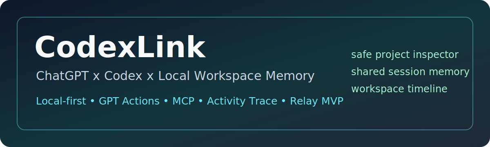
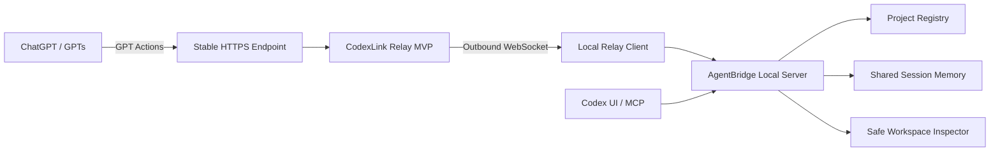

# CodexLink



**Local-first bridge for ChatGPT/GPTs, Codex UI, MCP, and workspace memory.**


CodexLink helps ChatGPT/GPTs and Codex understand a local project safely: explicit project registry, shared session memory, Activity Trace, Workspace Timeline, one-click Windows launcher, GPT Actions schemas, Codex MCP tools, and a zero-setup stable relay MVP.

The npm/package backend name is still `agentbridge`; the product name is **CodexLink**.

> **Honest status:** local/project memory, launcher, GPT Actions, plugin, activity trace, and workspace timeline are tested. The hosted relay is an MVP/experimental path for stable GPT Actions endpoints, not a production SaaS account/team workspace.

---

## Why CodexLink

| Value | What it means |
| --- | --- |
| Safe local project picker | GPTs can inspect only explicitly registered local projects. |
| Shared workspace memory | GPTs, Codex UI, MCP, and CLI can share session goals, handoffs, checks, evidence, and recent activity. |
| Activity Trace | CodexLink records what happened: handoff lifecycle, checks, evidence, file/workspace metadata. |
| Workspace Timeline | Ask what changed by handoff, file, task, or recent activity. |
| One-click launcher | On Windows, daily startup can be `start-codexlink.bat`. |
| Relay MVP | A stable HTTPS relay URL can forward paired metadata/inspector requests over outbound WSS. |
| Safe inspector | Read-only project tree, file search, bounded file read, grep, and review packets. |
| No OpenAI API key | CodexLink does not require an OpenAI API key. |
| No command runner | Relay/GPT Actions do not expose arbitrary shell execution. |
| No HTTP MCP | MCP remains STDIO-only; there is no `/mcp` HTTP endpoint. |

---

## Architecture



Quick tunnel and direct stable tunnel/domain flows are still supported. Relay mode is the zero-setup/stable-endpoint direction. In every mode, the local server remains the safety boundary and revalidates project IDs, paths, and read policies.

---

## Quick Start

### Link GPTs: https://chatgpt.com/g/g-6a1dc7d0f64481919bd011f2ff6c8535-codexlink

### Flow A: Local Launcher Only

```powershell
git clone https://github.com/TuanDanny/AgentBridge.git
cd AgentBridge
npm install
npm run build
node dist\cli.js project register-current AgentBridge
node dist\cli.js setup launcher --project AgentBridge
.\start-codexlink.bat
```

For the guided first-time Windows flow:

```powershell
.\setup-codexlink-first-time.bat
```

### Flow B: Hosted Relay MVP / Stable GPT Actions Path

Use this when GPT Actions need one stable HTTPS URL and you do not want to update a quick tunnel URL repeatedly.

1. Deploy or run the hosted relay MVP behind HTTPS/WSS.
2. Import `openapi.codexlink.relay.gpt-actions.json` into GPT Builder.
3. Configure the local launcher with the trusted relay URL.
4. Pair the device/session with the short-lived pairing code.

Start here:

- [Hosted Relay Guide](docs/guides/CODEXLINK_HOSTED_RELAY.md)
- [Relay Protocol Spec](docs/specs/CODEXLINK_RELAY_PROTOCOL.md)

---

## Daily Usage

Start:

```powershell
.\start-codexlink.bat
```

The launcher:

- starts or reuses local AgentBridge
- checks `/health`
- bootstraps shared session context
- copies a GPT greeting prompt
- opens the configured GPT URL when configured
- starts the hosted relay client when relay mode is configured

Stop:

```powershell
.\stop-codexlink.bat
```

---

## Feature Matrix

| Capability | Status |
| --- | --- |
| Safe project registry | Passed |
| GPT Actions project inspector | Passed |
| Shared session memory | Passed |
| Activity Trace | Passed |
| Workspace Timeline | Passed |
| Codex plugin SessionStart | Passed |
| One-click launcher | Passed |
| Relay GPT Actions schema | Passed |
| Zero-setup stable relay MVP | Experimental |
| Image artifact endpoint | Planned |
| Safe local edit / patch proposal | Planned |
| Docker packaging | Planned |

---

## Security Model

CodexLink is designed as a local-first bridge, not a remote workspace control plane.

- Projects must be explicitly registered or selected.
- Relay mode uses a per-device project allowlist.
- Pairing codes are short-lived and single-use.
- Hosted relay MVP stores pairing/session metadata in memory.
- Local AgentBridge remains the source of truth.
- No HTTP `/mcp` endpoint is exposed.
- No arbitrary shell or command runner is exposed.
- No write/edit/delete file route is exposed.
- No OpenAI API key is required.
- Safe file reads are bounded, redacted, and project-relative.
- `.env`, `.agentbridge/local_token`, private keys, binaries, traversal paths, and raw filesystem project IDs are blocked.
- Secrets and local tokens must never be committed, pasted into prompts, or shared.

---

## GPT Actions Schemas

| Schema | Use case |
| --- | --- |
| `openapi.agentbridge.gpt-actions.json` | Direct stable tunnel/domain mode with bearer auth. |
| `openapi.codexlink.relay.gpt-actions.json` | Hosted relay MVP mode with `X-CodexLink-Relay-Session`. |

Generate schemas:

```powershell
npm run generate:openapi
```

Direct GPT Actions helper:

```powershell
.\scripts\prepare-gpt-action.ps1
```

---

## Common Commands

Register projects:

```powershell
node dist\cli.js project register-current AgentBridge
node dist\cli.js project list
node dist\cli.js project select AgentBridge
```

Session memory and timeline:

```powershell
node dist\cli.js session bootstrap AgentBridge --source manual --json
node dist\cli.js session context AgentBridge --compact --json
node dist\cli.js session timeline AgentBridge --recent --json
node dist\cli.js session reconcile AgentBridge --json
```

Safe project browsing:

```powershell
node dist\cli.js project tree AgentBridge --json
node dist\cli.js project find-file AgentBridge README --json
node dist\cli.js project read-file AgentBridge README.md --json
node dist\cli.js project grep AgentBridge "readProjectFile" --json
node dist\cli.js project inspect AgentBridge --json
```

Relay MVP:

```powershell
node dist\cli.js relay hosted serve --host 0.0.0.0 --port 8788 --public-url https://relay.codexlink.example.com
node dist\cli.js relay client connect --relay-url https://relay.codexlink.example.com --project AgentBridge
node dist\cli.js relay spec
```

Docker-hosted relay:

```powershell
$env:CODEXLINK_PUBLIC_URL="https://relay.example.com"
docker compose up --build -d
Invoke-RestMethod http://127.0.0.1:8788/relay/health
```

The container runs only the hosted relay. It does not mount local projects, tokens, or `.agentbridge`; the local launcher/client remains on the user's machine. Put the container behind a trusted HTTPS/WSS reverse proxy before using it with GPT Actions.

Always-on Render deployment uses the repo Blueprint and serves the importable GPT Actions schema at:

```text
https://YOUR-RENDER-SERVICE.onrender.com/relay/openapi.json
```

See [Render Stable Relay Deployment](docs/guides/CODEXLINK_RENDER_DEPLOYMENT.md).

Diagnostics:

```powershell
node dist\cli.js doctor
node dist\cli.js doctor --launcher --json
```

---

## Codex Plugin

The local Codex plugin lives in:

```text
plugins/codexlink/
```

It provides:

- bundled MCP server config
- shared session skill instructions
- SessionStart hook
- repo-local marketplace entry

Setup:

```powershell
node dist\cli.js setup codex-plugin --dry-run
node plugins/codexlink/hooks/session_start.mjs --dry-run
```

Guide: [CodexLink Plugin Setup](docs/guides/CODEXLINK_PLUGIN_SETUP.md)

---

## Documentation

- [One-Click Launcher](docs/guides/CODEXLINK_ONE_CLICK_LAUNCHER.md)
- [Hosted Relay MVP](docs/guides/CODEXLINK_HOSTED_RELAY.md)
- [Render Stable Relay Deployment](docs/guides/CODEXLINK_RENDER_DEPLOYMENT.md)
- [Relay Protocol Spec](docs/specs/CODEXLINK_RELAY_PROTOCOL.md)
- [Zero-Setup Relay Plan](docs/architecture/CODEXLINK_ZERO_SETUP_RELAY_PLAN.md)
- [CodexLink Plugin Setup](docs/guides/CODEXLINK_PLUGIN_SETUP.md)
- [Activity Trace](docs/guides/CODEXLINK_ACTIVITY_TRACE.md)
- [Project Registry](docs/architecture/PROJECT_REGISTRY.md)
- [GPT Tool Adapter](docs/gpt/CHATGPT_TOOL_ADAPTER.md)

---

## Verification

```powershell
npm run generate:openapi
npm run build
npm test
git diff --check
powershell -NoProfile -ExecutionPolicy Bypass -File .\scripts\smoke-v12-hosted-relay-e2e.ps1
powershell -NoProfile -ExecutionPolicy Bypass -File .\scripts\smoke-v12-relay-loopback.ps1
docker compose config
```

Current local acceptance: 25 test files / 170 tests passing.

---

## Roadmap

- v1.2 relay MVP hardening
- image artifact endpoint for GPT-rendered diagrams
- safe patch proposal / edit review loop
- Docker packaging
- stable installer

---

## Limitations

> If you use Cloudflare Quick Tunnel, the GPT Actions URL can change. For no URL changes, use a stable tunnel/domain or relay mode.

> Relay MVP is experimental until deployed and security-tested in real use. It is intentionally read-only for workspace data and does not provide account/team/cloud workspace mode.

---

## License

MIT
