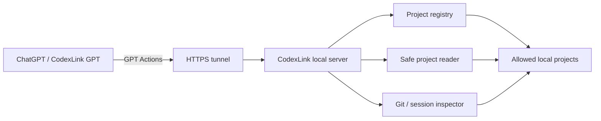

# CodexLink

**Connect ChatGPT/GPTs to your local Codex projects safely.**

CodexLink is a local-first bridge that lets ChatGPT inspect, search, and read files from projects you explicitly allow. It runs on your machine, exposes a token-protected local server, and can be connected to GPT Actions through a secure tunnel.

> Backend/package name may still appear as `AgentBridge` while the product name is moving to **CodexLink**.

---

## What it can do

- Show your registered local projects in ChatGPT.
- Let you choose the active project.
- Inspect Git status, branch, commits, tags, and changed files.
- Show a safe project tree.
- Search files by name.
- Read safe text files using project-relative paths.
- Search text across a project.
- Block secret files, private keys, binary files, path traversal, and raw absolute paths.
- Keep active-project selection and audit events local.

---

## How it works



CodexLink only exposes projects you register or scan-confirm. It does **not** scan your whole machine automatically.

---

## Quick start

### 1. Install and build

```powershell
cd D:\AgentBridge
npm install
npm run build
```

### 2. Start the local server

```powershell
node dist\cli.js start --host 127.0.0.1 --port 7777
```

The server creates a local token at:

```text
.agentbridge/local_token
```

Do not commit or share this token.

### 3. Register a project

```powershell
node dist\cli.js project register-current AgentBridge
```

Or register another local project:

```powershell
node dist\cli.js project register MyProject D:\Projects\MyProject
```

### 4. List projects

```powershell
node dist\cli.js project list
```

### 5. Connect GPT Actions

Generate the live GPT Action schema:

```powershell
.\scripts\prepare-gpt-action.ps1
```

Then in GPT Builder:

```text
Actions → paste schema → Authentication: API Key / Bearer → paste local token → Save → Update GPT
```

Paste only the token value, not `Bearer <token>`.

---

## Main CLI commands

```powershell
# Project registry
node dist\cli.js project register-current AgentBridge
node dist\cli.js project register MyProject D:\Projects\MyProject
node dist\cli.js project list
node dist\cli.js project remove MyProject

# Safe discovery
node dist\cli.js project scan D:\Projects --preview
node dist\cli.js project scan D:\Projects --register --select 1,3

# Safe project browsing
node dist\cli.js project tree AgentBridge --json
node dist\cli.js project find-file AgentBridge README --json
node dist\cli.js project read-file AgentBridge README.md --json
node dist\cli.js project grep AgentBridge "readProjectFile" --json

# Active project
node dist\cli.js project select AgentBridge
node dist\cli.js project active
node dist\cli.js project clear-active
```

---

## GPT Actions

CodexLink exposes these token-protected actions for GPTs:

| Action | Purpose |
|---|---|
| `listProjects` | Show registered projects |
| `inspectProject` | Inspect Git/repo/session status |
| `getCodexChanges` | Summarize Codex/project changes |
| `getReviewPacket` | Produce review context |
| `getProjectTree` | Show safe project tree |
| `searchProjectFiles` | Find files by name |
| `readProjectFile` | Read a safe text file |
| `searchProjectText` | Search text across project |
| `selectProject` | Set active project |
| `getActiveProject` | Show current active project |

---

## Codex Plugin

CodexLink v0.7-beta includes a local Codex plugin under `plugins/codexlink/`. After building, enable the repo marketplace in Codex, trust the `SessionStart` hook once, and the hook will run `session bootstrap` for the current project. Setup details are in `docs/guides/CODEXLINK_PLUGIN_SETUP.md`.

Dry-run check:

```powershell
node plugins/codexlink/hooks/session_start.mjs --dry-run
```

---

## Safety model

CodexLink is designed to be local-first and allowlist-based.

Blocked by default:

- Raw absolute paths such as `D:\...`
- Path traversal such as `../secret`
- `.env` and `.env.*`
- `.agentbridge/local_token`
- Private keys such as `.pem`, `.key`, `id_rsa`, `id_ed25519`
- Binary files
- HTTP project scan endpoints
- `/mcp` HTTP endpoint

Large safe text files are returned with `truncated=true` instead of being read without limit.

---

## Example GPT workflow

Ask your CodexLink GPT:

```text
Start CodexLink and show my available projects.
```

Then:

```text
Choose AgentBridge.
Show the project tree with depth 3.
Find files containing projectFiles.
Read src/projectFiles.ts and summarize it.
Search for readProjectFile across the project.
Set AgentBridge as the active project.
```

---

## Current status

| Milestone | Status |
|---|---|
| v0.4 Direct GPT Action handshake | Passed |
| v0.5-alpha Project registry | Passed |
| v0.5-beta Safe project scan | Passed |
| v0.5-gamma Safe tree/file reader | Passed |
| v0.5-delta Active project + audit | Passed |
| Level 4 controlled task dispatch | Planned |

---

## Development checks

```powershell
npm run build
npm test
git diff --check
```

Full local acceptance test:

```powershell
powershell -NoProfile -ExecutionPolicy Bypass -File .\scripts\test-codexlink-v05-gamma-delta-full-workflow.ps1
```

Expected result:

```text
OKKK - v0.5-gamma/v0.5-delta full workflow acceptance passed
```

---

## Documentation

Additional docs live under `docs/`:

- `docs/guides/` for bridge, tunnel, and companion workflows.
- `docs/architecture/` for inspector and registry design notes.
- `docs/specs/` for MCP, safety, and protocol specs.
- `docs/gpt/` for GPT Actions setup and instructions.
- `docs/acceptance/` for milestone acceptance records.

---

## Notes

- CodexLink does not require an OpenAI API key.
- GPT Actions use your local CodexLink bearer token, not an OpenAI API key.
- Quick Cloudflare tunnel URLs can change after restart. Use a fixed tunnel/domain for serious use.
- The HTTP `/mcp` endpoint is not implemented; MCP remains STDIO-only for now.
